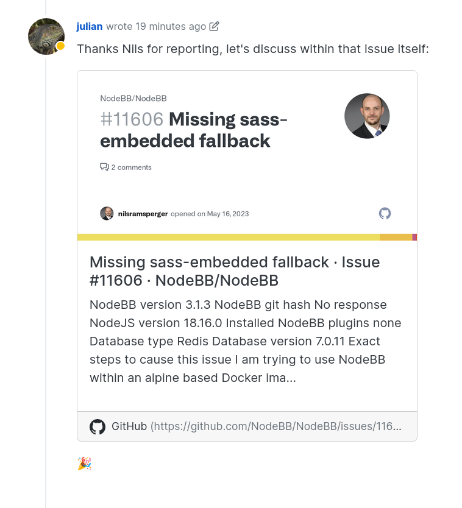

# Link Preview Plugin for NodeBB

This plugin adds in additional post parsing capability to NodeBB so that any external links are automatically expanded into an interactive box containing any available metadata (e.g. photo, title, description, etc.)

The content shown in the box is powered by [Open Graph tags](https://ogp.me), and this plugin uses [link-preview-js](https://www.npmjs.com/package/link-preview-js) in the backend.

## Installation

This plugin comes bundled with NodeBB installs as of v3.1.0. If you wish to use it in older versions, or wish to install it manually, run either of the two commands below:

    npm install nodebb-plugin-link-preview

    yarn add nodebb-plugin-link-preview

## Screenshots

